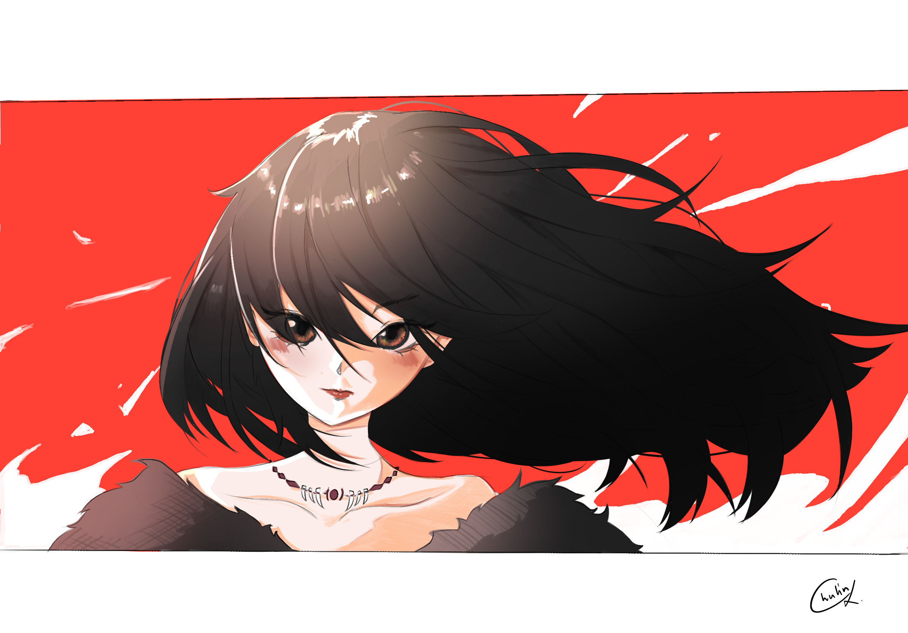

<!-- Improved compatibility of back to top link: See: https://github.com/othneildrew/Best-README-Template/pull/73 -->

<!--
*** Thanks for checking out the Best-README-Template. If you have a suggestion
*** that would make this better, please fork the repo and create a pull request
*** or simply open an issue with the tag "enhancement".
*** Don't forget to give the project a star!
*** Thanks again! Now go create something AMAZING! :D
-->

<!-- PROJECT SHIELDS -->
<!--
*** I'm using markdown "reference style" links for readability.
*** Reference links are enclosed in brackets [ ] instead of parentheses ( ).
*** See the bottom of this document for the declaration of the reference variables
*** for contributors-url, forks-url, etc. This is an optional, concise syntax you may use.
*** https://www.markdownguide.org/basic-syntax/#reference-style-links
-->

<!-- PROJECT LOGO -->
 

  

  <h3 align="center">Chulinxz</h3>

  

    Computer Engineering and Digital Technolog (CEDT) 's Student, CU BKK
     
    

    <a href="https://github.com/Chulinuwu/Chulinuwu"><strong>README DOCS</strong></a>
    

  

<!-- ABOUT THE PROJECT -->

# Hello, I'm An-An ✨

I'm Developer and UX/UI Designer , and I'm currently focused on learning ML/AI , but I'm enthusiastic about combining my technical skills with creativity to contribute to the dynamic field of technology. Stay tuned for more as I continue to learn and grow.

## Stats ✨

    <!-- Your GitHub Stats SVG Image Goes Here -->
    

# Art

<!-- <td align="center"></td> 
 -->
<td align="center"></td>
<!-- <table>
  <tr>
    <td align="center"></td>
    <td align="center"></td>
  </tr>
</table> -->

<!-- CONTACT -->
## Contact ✨

Chulinxz 🚀 - [My Intragram](https://www.instagram.com/vyovyo___/) - ananzxzoxd@gmail.com

Web Portfolio 🎨 : [Click Here](https://chulin-folio2.vercel.app/)

(<a href="#readme-top">back to top</a>)

<!--
**Chulinuwu/Chulinuwu** is a ✨ _special_ ✨ repository because its `README.md` (this file) appears on your GitHub profile.

Here are some ideas to get you started:

- 🔭 I’m currently working on ...
- 🌱 I’m currently learning ...
- 👯 I’m looking to collaborate on ...
- 🤔 I’m looking for help with ...
- 💬 Ask me about ...
- 📫 How to reach me: ...
- 😄 Pronouns: ...
- ⚡ Fun fact: ...
-->
