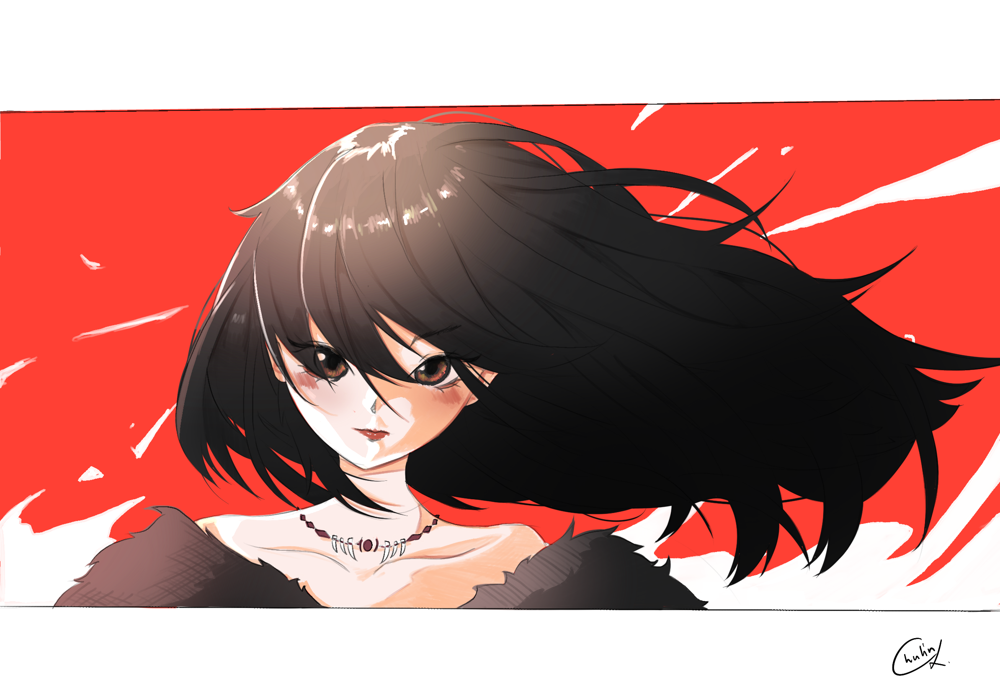

<!-- Improved compatibility of back to top link: See: https://github.com/othneildrew/Best-README-Template/pull/73 -->

<!-- PROJECT LOGO -->
 

  

  <h3 align="center">Chulinxz</h3>

  

    Computer Engineering and Digital Technology (CEDT) Student, CU BKK
     
    <a href="https://github.com/Chulinuwu/Chulinuwu"><strong>README DOCS</strong></a>
  

<!-- ABOUT THE PROJECT -->
# Hello, I'm An-An ✨

I'm a Developer and UX/UI Designer, currently focused on learning ML/AI. I'm enthusiastic about combining my technical skills with creativity to contribute to the dynamic field of technology. Stay tuned for more as I continue to learn and grow.

# Stat

# Lang

&nbsp;

# Streak  

# Art

<td align="center"></td>

<!-- CONTACT -->
## Contact ✨

Chulinxz 🚀 - [My Instagram](https://www.instagram.com/vyovyo___/) - ananzxzoxd@gmail.com

Web Portfolio 🎨 : [Click Here](https://chulin-folio2.vercel.app/)

(<a href="#readme-top">back to top</a>)

